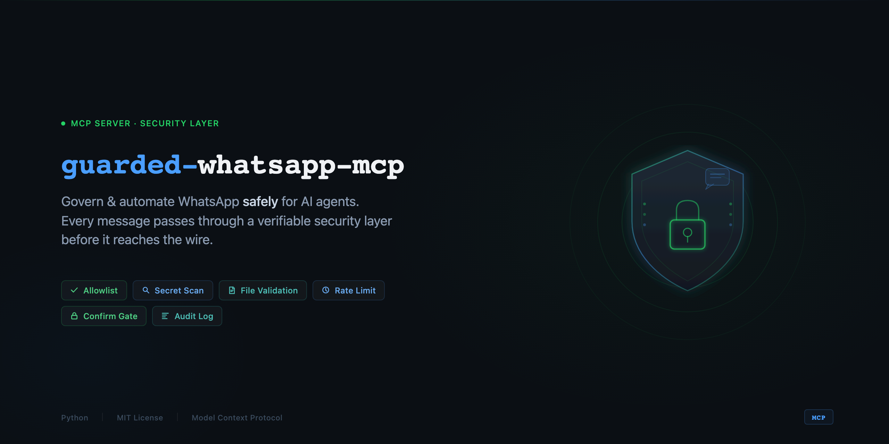
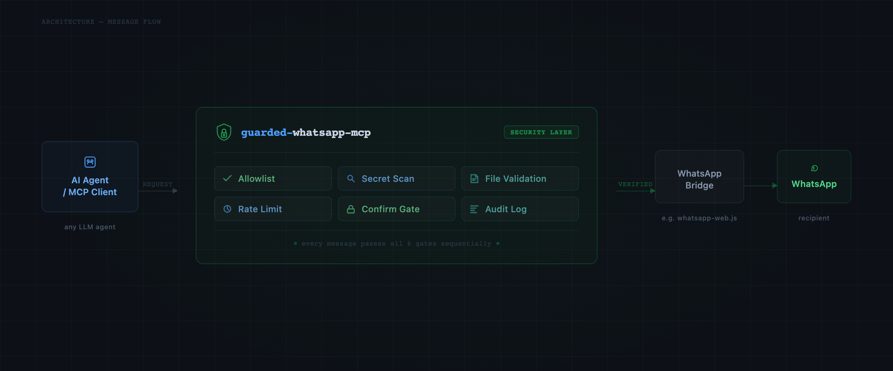

<div align="center">



# guarded-whatsapp-mcp

**Govern & automate WhatsApp safely for AI agents.**

[](LICENSE)
[](pyproject.toml)
[](https://modelcontextprotocol.io)
[](#roadmap)
[](CONTRIBUTING.md)

</div>

An [MCP](https://modelcontextprotocol.io) server that lets an AI agent (or any MCP client)
send WhatsApp messages and files — but only through a security gate you control: a
recipient **allowlist**, **secret scanning**, **file validation**, **rate limiting**, a
**confirmation gate**, and an append-only **audit log**.

Most WhatsApp bridges send anything, anywhere, with no record. That is fine for a human
clicking *send*. It is not fine for an autonomous agent. **guarded-whatsapp-mcp is the
governance layer** that makes agent-driven WhatsApp safe enough to trust.

> **This is not a Slack replacement.** No channels, no threads, no workspace UI. It makes
> the WhatsApp you *already use* safe to automate.

## See it in action

<div align="center">

<br><sub>Good sends go through · a leaked key and an un-allowlisted number are blocked · files need a preview · everything is logged.</sub>
</div>

## How it works

<div align="center">

</div>

---

## ⚠️ Read this first — unofficial transport & WhatsApp Terms

This server governs access to a transport; by default that transport is the **unofficial
[whatsmeow](https://github.com/tulir/whatsmeow)-based bridge** (e.g.
[`whatsapp-mcp`](https://github.com/lharries/whatsapp-mcp)), which speaks WhatsApp Web's
private protocol.

- An unofficial client **violates WhatsApp's Terms of Service** and **can get a number
  banned**. A reverse-engineered client cannot avoid this.
- **Use a secondary / non-critical number.** Never your primary or business-critical one.
- **Not for production customer messaging** — use the official
  [WhatsApp Business Cloud API](https://developers.facebook.com/docs/whatsapp). An official
  Cloud-API backend is on the [roadmap](#roadmap); the guard layer is built to front either
  transport.

The guardrails here reduce **operational** risk (wrong recipient, leaked secret, spam).
They do **not** change the **Terms-of-Service** risk of the underlying bridge. We are loud
about this on purpose so you can choose with eyes open.

---

## Why teams use it

| Without a guard | With guarded-whatsapp-mcp |
|---|---|
| Agent can message *any* number it generates | Fail-closed **allowlist** — strangers are refused |
| A leaked API key sails out in a message | **Secret scan** blocks it before it sends |
| A runaway loop spams the team 200× | **Rate limit** caps it |
| Files arrive as `Untitled`; paths unchecked | **ASCII-safe filenames** + type/size checks |
| No idea what the agent sent | Append-only **audit log** of every attempt |
| Accidental sends | **Confirmation gate** — risky sends must be previewed |

## Security controls

| Control | What it does |
|---|---|
| **Recipient allowlist** | Fail-closed. With `allow_unlisted: false`, only people/groups in your config can be messaged — even a raw number is refused. |
| **Secret / PII scan** | Text + captions scanned for API keys, private keys, cloud/Slack/GitHub/OpenAI tokens, JWTs, credit cards (Luhn), national IDs. `block` or `warn`. |
| **File validation** | Extension allowlist + size cap. Filenames sanitized to ASCII (no `Untitled`, no path traversal); copied to a safe name before sending. |
| **Rate limiting** | Sliding window (per-minute + per-hour) stops runaway loops. |
| **Confirmation gate** | Risky sends (unlisted / files / all) need a `confirm_token` from `wa_preview` — proof the send was previewed, not accidental. |
| **Audit log** | Every attempt (sent / blocked / failed) appended to `~/.guarded-whatsapp-mcp/audit.jsonl`, with body stored as preview + hash only. |

## Tools

| Tool | Gated? | Purpose |
|---|---|---|
| `wa_list_recipients` | read-only | Show the allowlist (numbers masked). |
| `wa_preview` | read-only | Dry-run a send: run every check, return a verdict + `confirm_token` if needed. Sends nothing. |
| `wa_send_message` | **send** | Send text to an allowlisted recipient through the full gate. |
| `wa_send_file` | **send** | Send a file (auto ASCII-safe name, type/size checked, caption scanned). |
| `wa_audit_tail` | read-only | Recent audit records. |

## Quickstart

```bash
git clone https://github.com/peter-tnc-453/guarded-whatsapp-mcp
cd guarded-whatsapp-mcp

uv venv --python 3.11 && source .venv/bin/activate   # Python 3.10+
uv pip install -e .

cp config/allowlist.example.yaml config/allowlist.yaml   # edit your allowlist (git-ignored)

# a WhatsApp bridge exposing POST /api/send must be running (the authenticated session).
# whatsmeow bridge: https://github.com/lharries/whatsapp-mcp  (first run = QR scan)

python -m wa_guard          # run the MCP server (stdio)
```

### Register with Claude Code / any MCP client

```json
{
  "mcpServers": {
    "guarded-whatsapp-mcp": {
      "command": "/ABSOLUTE/PATH/guarded-whatsapp-mcp/.venv/bin/python",
      "args": ["-m", "wa_guard"],
      "env": {
        "PYTHONPATH": "/ABSOLUTE/PATH/guarded-whatsapp-mcp/src",
        "WA_GUARD_CONFIG": "/ABSOLUTE/PATH/guarded-whatsapp-mcp/config/allowlist.yaml"
      }
    }
  }
}
```

## Example — a safe agent flow

```jsonc
// 1) The agent previews first (read-only, sends nothing)
wa_preview(recipient="Alex", file_path="report.pdf")
// → { ok:false, needs_confirm:true, confirm_token:"a1b2c3d4e5",
//     display_filename:"report.pdf", recipient:{ name:"Alex", allowlisted:true } }

// 2) It sends, passing the token back to prove the preview happened
wa_send_file(recipient="Alex", file_path="report.pdf", confirm_token="a1b2c3d4e5")
// → { sent:true, ... }   (and one line is appended to the audit log)

// A blocked attempt is explicit and recorded:
wa_send_message(recipient="+66999999999", message="hi")
// → { sent:false, blocked_reason:"recipient is not allowlisted and allow_unlisted=false" }
```

## Configuration

See [`config/allowlist.example.yaml`](config/allowlist.example.yaml). Key knobs:
`allow_unlisted` (the fail-closed switch), `require_confirm_for`, `rate_limit`, `files`,
`secrets.on_detect`, and the `recipients` allowlist. Edits hot-reload on each call.

## Roadmap

- **Pluggable backend** — same guard layer in front of the unofficial bridge *or* the
  official **WhatsApp Business Cloud API** (compliant path).
- **Inbound routing** — surface incoming messages to agents (read · classify · route).
- **Scheduled / templated sends** through the same gate.
- **Per-recipient policy** (rate limits / confirm rules per contact or group).

## Tests

```bash
uv pip install pytest && PYTHONPATH=src python -m pytest -q   # 19 passing
```

## Contributing

PRs welcome — see [CONTRIBUTING.md](CONTRIBUTING.md). The one rule: **keep the fail-closed
posture**, and add a test for every new check.

## License

MIT — see [LICENSE](LICENSE). Security model & honest limitations in [SECURITY.md](SECURITY.md).
